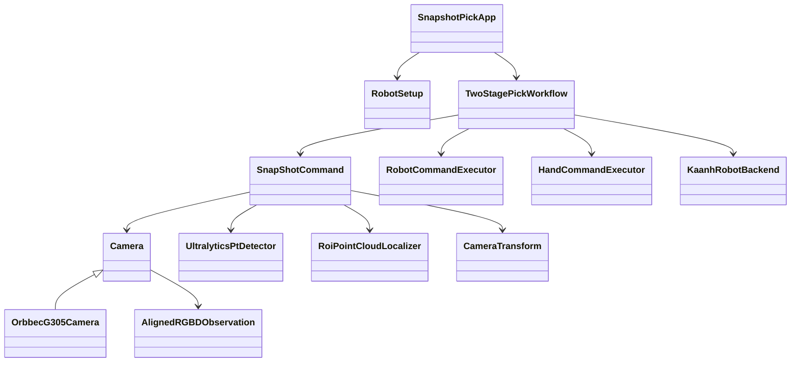

# KaanhPilot 当前代码地图

更新时间：2026-09-16

代码基线：`master@c74d54d`

工作区状态：检查时无未提交修改。

## 1. 文档定位

本文只描述当前代码事实。目标分层见 [ARCHITECTURE.md](./ARCHITECTURE.md)，实施顺序见 [PROJECT_PLAN.md](./PROJECT_PLAN.md)，术语见 [CONTEXT.md](./CONTEXT.md)。

## 2. 当前受支持入口

| 入口 | 用途 | 当前状态 |
|---|---|---|
| `two_stage_pick.py` | 常驻相机、目标选择、两阶段定位与抓取 | 主 Demo 入口；已接入并真机验证 Workflow |
| `seven_controller.py` | 机器人监控、3D 显示和手动动作调试 | 测试入口；当前存在 `GraspCommand` 旧名称导入错误 |
| `agent_api.py` | 旧前端 HTTP 适配和任务原型 | 暂非受支持入口；等待前端定稿后重新接入 |
| `commands/get_camera_intri.py` | 导出相机内参与深度到 RGB 外参 | 维护工具，不属于业务主入口 |

`camera`、`robot` 等模块内仍有少量 `__main__`，它们属于模块诊断入口，不应作为项目启动方式对外说明。

## 3. 当前两阶段抓取调用链

```text
two_stage_pick.py
  → SnapshotPickApp
      → RobotSetup
      → KaanhRobotBackend（监控连接 + 控制连接）
      → OrbbecG305Camera
      → UltralyticsPtDetector
      → SnapShotCommand
      → TwoStagePickWorkflow.execute()
          → SnapShotCommand.capture_once() × 2
          → KaanhRobotBackend.movel_model()
          → RobotCommandExecutor
          → HandCommandExecutor
```

`SnapshotPickApp` 使用独立的监控、控制和视觉线程。用户先冻结一帧并选择目标，真正执行前 Workflow 会重新采集最新图像并再次定位。

## 4. 当前目录职责

| 目录或文件 | 当前职责 |
|---|---|
| `two_stage_pick.py` | 两阶段抓取 Demo 的组合根、状态机和界面 |
| `seven_controller.py` | 底层机器人动作与 3D 状态测试入口 |
| `commands/` | 当前仍使用的机器人、灵巧手、相机和感知操作 |
| `commands/legacy/` | 已不进入主链路、仅供参考的历史功能 |
| `workflows/` | 跨 Command 的完整物理流程 |
| `camera/` | 相机公共契约、Orbbec 适配器和观测保存 |
| `perception/` | 目标跟踪和 ROI 点云定位 |
| `planner/` | 坐标变换、位姿运算和 follower 桥接 |
| `robot/` | 机器人、AGV、门控设备及状态解析 |
| `visualization/` | 2D、3D 和机器人状态可视化 |
| `yolo/` | 目标检测器、标签和检测数据结构 |
| `config/` | 设备、模型、感知和标定配置 |

## 5. 核心依赖关系



相机侧已经形成公共 `Camera` 和 `AlignedRGBDObservation` 契约。机器人、Command 和 Workflow 目前仍直接依赖具体 `KaanhRobotBackend`。

## 6. 两阶段抓取 Workflow 状态

`TwoStagePickWorkflow.execute()` 当前已经负责：

1. 第一次拍照定位。
2. 移动到第二次拍照位置。
3. 第二次拍照精定位。
4. 移动到预抓取位姿。
5. 最终接近、抓取、搬运、释放并回到初始位姿。

当前限制：

- 偏移量、灵巧手 ID 和抓取后的临时动作序列仍硬编码在 Workflow 中。
- 未检测到目标时直接返回 `None`，尚未形成供任务队列消费的结构化结果。
- `two_stage_pick.py` 末尾仍保留一份未调用的 `_two_stage_pick()` 旧实现，与正式 Workflow 重复。
- Workflow 直接调用 `robot.movel_model()`，机器人公共契约尚未形成。

## 7. Commands 与 Legacy

当前 `commands/` 主体已经收敛为：

- `robot_commands.py`：关节运动、笛卡尔偏移和 follower 调试动作。
- `hand_commands.py`：灵巧手回零、准备、抓取和释放。
- `snapshot.py`：RGB-D 采集、检测、点云定位和坐标转换。
- `setup.py`：配置加载和运行对象构造。
- `get_camera_intri.py`：相机标定参数导出工具。

`commands/legacy/` 当前保存旧的 YOLO 相机、连续跟随和滤波对比功能。Legacy 代码不保证与当前接口同步，也不应被新 Workflow 依赖。

## 8. Follower 已知限制

现有 follower 尚未完成多模型双七轴适配：

- `RobotState.tcp_pq` 和 `tcp_pe` 兼容字段固定映射到模型 0。
- `start_follower()`、`FollowerBridge` 和 `send_pose_pq()` 没有显式 `model_id`。
- follower 起始位姿、目标位姿和运行状态在 Backend 中各只有一份，不能区分左右七轴臂。
- UDP 数据结构及控制器端如何选择目标模型尚未形成明确契约。
- `FollowerBridge` 当前固定沿用启动姿态，并保留测试场景硬编码接近偏移。

在完成模型选择、状态读取、UDP 协议和双臂并发策略之前，follower 只能视为模型 0 的实验功能。

## 9. `mvl` 已知限制

`movel()` 和 `movel_model()` 会组装完整的七段 `RobotTarget`。当前实现需要控制器已加载与现有多模型布局和变量定义匹配的工程，才能正确读取或接受其余模型目标。

因此当前 `mvl` 不是独立于控制器工程的通用接口。后续需要与控制器侧确认：

- 哪些目标字段必须来自已加载工程变量。
- 是否能直接传入完整多模型目标而不依赖工程变量。
- 模型顺序、目标类型和可选字段的稳定协议。
- 单臂移动时其余模型应使用当前状态、显式保持值还是控制器默认值。
- 工程未加载或变量不匹配时如何在发运动指令前失败。


## 11. 发布后技术债

- 建立持久化任务队列和单 Worker。
- 为机器人真机与仿真建立公共契约。
- 完成 follower 的多模型双七轴适配。
- 消除 `mvl` 对控制器已加载工程变量的隐式依赖。
- 将两阶段 Workflow 的标定参数和临时动作移入场景配置。
- 等前端定稿后重新实现薄的 `agent_api` 适配层。

## 12. 维护规则

入口、核心类职责、Workflow 调用链或已知硬件前置条件发生变化时更新本文；普通参数微调不要求更新。
