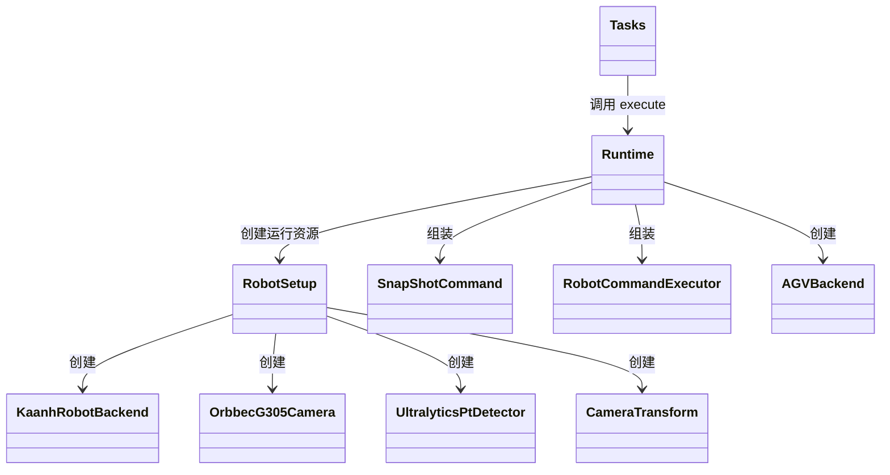
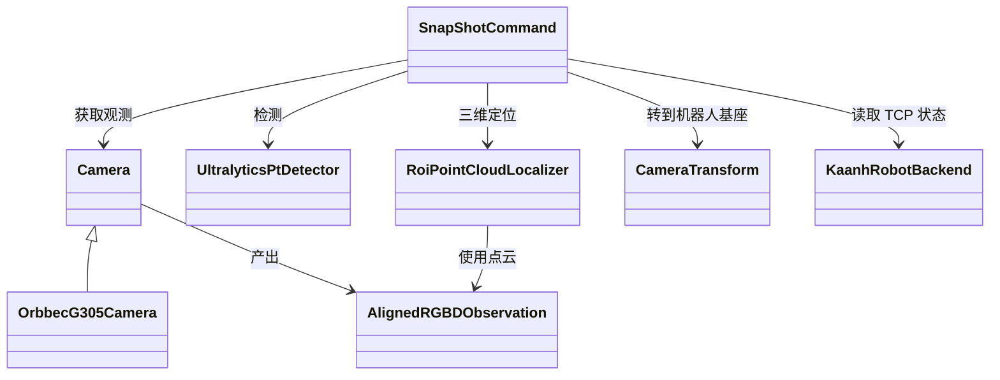
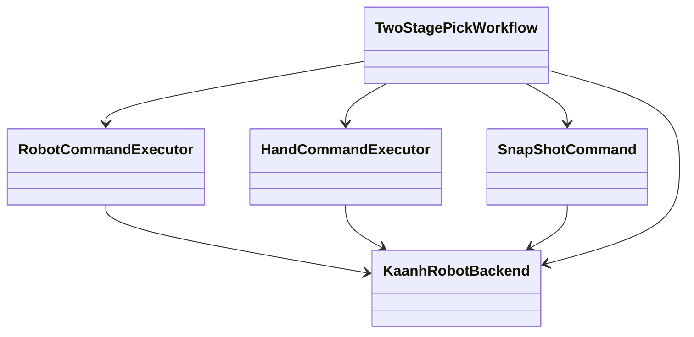

# KaanhOrbit 当前代码地图

更新时间：2026-09-16  
代码基线：`master@686a2b0`  
工作区状态：存在未提交修改和新增文件，本文描述当前工作区，而不只描述 Git 提交内容。

## 1. 文档定位

本文回答“当前代码实际上如何组织和运行”。

- 项目目标和实施顺序见 [PROJECT_PLAN.md](./PROJECT_PLAN.md)。
- 目标程序分层见 [ARCHITECTURE.md](./ARCHITECTURE.md)。
- 项目术语见 [CONTEXT.md](../CONTEXT.md)。

## 2. 当前主要入口

| 入口 | 当前职责 | 状态 |
|---|---|---|
| `agent_api.py` | 前端 HTTP 接口、任务记录、硬件初始化和商品动作分派 | Demo，职责较多 |
| `controller.py` | 原有键盘指令队列和机器人控制线程 | 旧控制入口 |
| `commands/*.py` | 相机、机器人、夹爪和感知相关的独立操作入口 | 持续整理中 |
| `workflows/two_stage_pick_workflow.py` | 两阶段视觉抓取流程草稿 | Incomplete |

当前前端演示主链路：

```text
前端
  → agent_api HTTP Handler
  → Tasks.submit()
  → 后台线程 Tasks.run()
  → Runtime.execute(item_id)
  → Runtime.pick_xxx()
  → 相机 / 感知 / 机器人 / AGV
```

## 3. 当前目录职责

| 目录或文件 | 当前职责 |
|---|---|
| `agent_api.py` | 前端接口及当前演示运行时 |
| `commands/` | 面向设备或感知能力的操作封装 |
| `workflows/` | 跨多个 Command 的业务流程，当前仍在形成中 |
| `camera/` | 厂商无关相机契约、Orbbec 适配器和观测保存 |
| `perception/` | 检测结果处理、目标跟踪和 ROI 点云定位 |
| `planner/` | 坐标变换、位姿计算和运动辅助 |
| `robot/` | Kaanh 机器人、AGV 和状态解析 |
| `config/` | 机器人、相机、模型、感知和标定配置 |
| `visualization/` | 2D、3D 和机器人状态可视化 |
| `yolo/` | 目标检测器和标签映射 |

## 4. 当前核心对象构造关系



`Runtime` 当前是主要组合根：启动真实模式时创建并连接机器人、启动相机、加载检测模型和标定配置，然后构造动作执行器。

## 5. 当前相机与感知依赖



当前较稳定的边界：

- `Camera` 是厂商无关抽象接口。
- `OrbbecG305Camera` 是真实相机适配器。
- `AlignedRGBDObservation` 统一保存对齐 RGB、深度、点云和标定信息。
- 感知层消费公共观测，不需要直接访问 Orbbec SDK。

`SnapShotCommand` 当前输出的核心结果是 `TargetPoint`，包含相机坐标和机器人基座坐标下的目标点。咖啡机按键等场景未来还需要包含方向或表面法向的操作位姿。

## 6. 当前机器人与 Workflow 依赖



当前状况：

- `KaanhRobotBackend` 封装真实机器人 WebSocket/UDP 通信和状态读取。
- `RobotCommandExecutor` 封装常用机械臂运动。
- `HandCommandExecutor` 封装夹爪抓取和释放。
- `AGVBackend` 独立封装移动底盘通信和导航状态。
- 多个 Command 和 Workflow 仍直接依赖具体 `KaanhRobotBackend`，尚无真机与仿真共用的机器人契约。
- `TwoStagePickWorkflow.execute()` 目前只做参数检查；实际两阶段动作仍位于类外辅助函数中，且尚未被 `agent_api.py` 调用。

## 7. 当前任务管理

`agent_api.Tasks` 当前提供：

- 使用 `request_id` 做提交幂等检查。
- 将任务状态写入 JSON 文件。
- 在后台线程执行任务。
- 提供任务列表和单任务查询。
- 启动时将遗留的 `queued`、`running` 任务改为 `needs_attention`。

它目前还不是任务队列：

- 存在活动任务时直接拒绝新请求。
- 没有 FIFO 等待队列。
- 每个被接受的任务直接创建线程。
- 任务管理与前端 HTTP 接口位于同一文件和进程。

## 8. 配置依赖

`RobotSetup` 当前集中读取和组装：

```text
config/robot/          机器人连接配置
config/camera/         相机 Profile 和深度处理配置
config/model/          检测模型与标签
config/perception/     定位、跟踪和显示参数
config/calibration/    固定相机及眼在手上相机外参
```

`RobotSetup.setup_robot()` 和 `setup_camera()` 当前直接创建真实设备实现，因此未来仿真模式需要在组合根或运行环境工厂中选择不同适配器。

## 9. 关键类速查

| 类 | 文件 | 当前职责 | 主要依赖 | 当前状态 |
|---|---|---|---|---|
| `Runtime` | `agent_api.py` | 初始化硬件并按商品分派动作 | `RobotSetup`、相机、机器人、AGV | Demo |
| `Tasks` | `agent_api.py` | 任务记录、互斥和后台执行 | `Runtime`、JSON 文件 | Demo |
| `RobotSetup` | `commands/setup.py` | 加载配置并创建运行对象 | 真实设备适配器、配置文件 | Demo |
| `TwoStagePickWorkflow` | `workflows/two_stage_pick_workflow.py` | 两阶段定位和抓取编排 | 机器人及多个 Command | Incomplete |
| `SnapShotCommand` | `commands/snapshot.py` | 获取观测、检测、定位和坐标转换 | Camera、Detector、Localizer、Transform、Robot | Demo |
| `RobotCommandExecutor` | `commands/robot_commands.py` | 常用机械臂运动 | `KaanhRobotBackend` | Demo |
| `HandCommandExecutor` | `commands/hand_commands.py` | 夹爪抓取和释放 | `KaanhRobotBackend` | In Progress |
| `KaanhRobotBackend` | `robot/kaanh_backend.py` | 真机通信和状态读取 | WebSocket、UDP | Demo |
| `AGVBackend` | `robot/agv_backend.py` | AGV 通信与导航 | Modbus | Demo |
| `Camera` | `camera/contracts/interface.py` | 厂商无关相机生命周期和取帧接口 | 公共数据契约 | Stable |
| `OrbbecG305Camera` | `camera/adapters/orbbec/g305.py` | G305 RGB-D 相机适配 | Orbbec SDK | Demo |
| `AlignedRGBDObservation` | `camera/contracts/cam_structs.py` | 统一 RGB-D 观测 | NumPy、标定数据 | Stable |
| `RoiPointCloudLocalizer` | `perception/roi_localizer.py` | 在检测 ROI 中计算三维目标点 | RGB-D 观测、Detection | Demo |
| `CameraTransform` | `planner/camera_transform.py` | 相机坐标与机器人基座坐标转换 | 相机外参、机器人 TCP | Demo |

## 10. 已知结构缺口

1. `agent_api.py` 同时承担接口适配、任务管理、硬件初始化和动作编排。
2. 当前 `Tasks` 是忙时拒绝机制，不是持久化 FIFO 队列。
3. `TwoStagePickWorkflow` 尚未接入当前前端演示链路。
4. 机器人侧尚无真机与仿真共用的最小公共契约。
5. 尚无公司仿真机器人或公司模拟相机适配器；模拟相机接口形式仍待沟通。
6. `Runtime(dry_run=True)` 不创建硬件资源，但商品动作仍可能访问真实硬件成员。
7. `agent_api.py` 和部分代码仍导入当前工作区中不存在的 `commands/grasp_command.py`，运行前需要确认该模块的去向。
8. 当前工作区包含较多未提交改动，本文状态应在代码冻结后重新建立一次干净基线。

## 11. 维护规则

以下情况需要更新本文：

- 新增或替换主要运行入口。
- 核心类的职责或依赖方向改变。
- Workflow 正式接入执行链。
- Task Service 或仿真适配器落地。
- 模块状态从 `Incomplete`、`Demo` 变为 `Stable`。

普通函数修改、参数调整和局部缺陷修复不要求更新本文。
