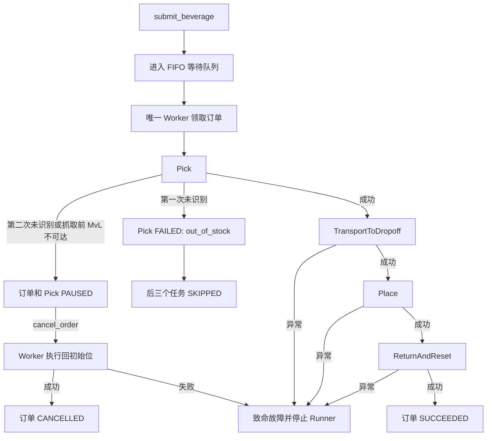

# TaskRunner 使用说明

## 1. 模块用途

TaskRunner 是一个**仅保存在内存中的机器人饮料订单调度器**。它维护一个
全局 FIFO 等待队列，并使用唯一 Worker 串行执行每个订单的固定四阶段任务链：

```text
抓取 Pick
  → 进入运输姿态并导航到放置站 TransportToDropoff
  → 放置饮料 Place
  → AGV 返回抓取站并让机器人回初始位 ReturnAndReset
```

当前版本不使用 SQLite，不恢复进程退出前的订单，也不提供 HTTP 接口。

## 2. 文件职责

| 文件 | 用途 | 一般调用方是否需要直接导入 |
| --- | --- | --- |
| `taskrunner_contracts.py` | 订单/任务状态、暂停原因、执行结果和只读快照 | 需要读取状态时使用 |
| `errors.py` | 队列满、订单不存在、不可取消、致命故障等异常 | 建议按需捕获 |
| `queue.py` | 线程安全、有界、可删除的 FIFO；只保存等待订单 ID | 不需要 |
| `orders.py` | 饮料订单实体、固定任务链和真机动作适配器 | 自定义动作或扩展订单时使用 |
| `monitor.py` | 通过独立控制器连接监控掉使能和错误码 | 真机组装时使用 |
| `runner.py` | 单 Worker、状态流转及主要公共接口 | 核心入口 |
| `runtime.py` | 真实机器人、相机、Workflow 和 AGV 的对象组装与启动基线 | 真机入口使用 |
| `cli.py` | 长时运行的交互测试终端 | 人工联调使用 |
| `PLAN.md` | 第一版的完整设计约束和测试计划 | 设计审阅使用 |

常规业务代码可以直接这样导入：

```python
from taskrunner import OrderStatus, TaskRunner, TaskStatus
```

## 3. 核心执行流程



一个订单开始执行后会独占机器人，四个阶段之间不会穿插其他订单。

## 4. TaskRunner 公共接口

### `start()`

启动基线检查、唯一 Worker 和可选控制器监控。必须在提交订单前调用。

Runner 正常关闭或发生致命故障后不能重新启动，需要重新构造运行时。

### `submit_beverage(item_id)`

提交饮料订单，返回提交瞬间的 `OrderSnapshot`。

支持的商品 ID：

| `item_id` | 视觉检测标签 |
| --- | --- |
| `water` | `mineral_water` |
| `cola` | `coco_cola` |
| `oolong_tea` | `oolong_tea` |

等待队列默认最多 10 个订单。当前正在执行的订单不计入这 10 个名额。

### `get_queue()`

返回 `QueueSnapshot`：

- `current_order`：当前活动订单，没有则为 `None`。
- `pending_orders`：按 FIFO 顺序排列的等待订单。
- `pending_count`：等待订单数量。
- `capacity`：等待队列容量。

终态订单不会出现在队列快照中。

### `get_order(order_id)`

按 ID 查询完整订单快照，包括四个任务的状态、错误码和暂停原因。终态订单在
当前进程退出前仍可查询。

### `cancel_order(order_id)`

取消行为取决于当前状态：

| 订单状态 | 行为 |
| --- | --- |
| `QUEUED` | 立即从 FIFO 删除；抓取任务 `CANCELLED`，后续任务 `SKIPPED` |
| `PAUSED` | 返回 `CANCELLING`；唯一 Worker 异步回初始位，成功后 `CANCELLED` |
| `RUNNING` | 抛出 `OrderNotCancellableError`，首版不允许运动中取消 |
| 已终态 | 幂等返回当前快照，不重复执行动作 |

首版没有 `resume()`。暂停订单只能查询或取消。

暂停订单仍占用当前活动槽位，因此后续订单可以继续提交，但会留在 FIFO 中，
直到暂停订单被取消或系统因致命故障退出。

### `shutdown()`

系统空闲时停止监控和 Worker。仍有活动或等待订单时抛出
`RunnerBusyError`，防止直接断开正在使用的硬件。

## 5. 最小 Python 示例

下面的示例不连接硬件，只展示如何实现动作端口并使用公共接口：

```python
import time

from taskrunner import TaskRunner
from taskrunner.taskrunner_contracts import (
    RobotTaskType,
    TaskExecutionResult,
    TERMINAL_ORDER_STATUSES,
)


class DemoActions:
    def execute(
        self,
        task_type: RobotTaskType,
        *,
        item_id: str,
        target_id: str,
    ) -> TaskExecutionResult:
        print("执行", task_type.value, item_id, target_id)
        return TaskExecutionResult.succeeded()

    def cancel_paused_pick(self) -> None:
        print("模拟回到初始位")


runner = TaskRunner(DemoActions(), queue_capacity=10)
runner.start()

submitted = runner.submit_beverage("water")
print("订单 ID:", submitted.order_id)
print("队列:", runner.get_queue())
print("订单:", runner.get_order(submitted.order_id))

# Worker 是异步线程；等待订单进入终态后才能正常关闭。
while runner.get_order(submitted.order_id).status not in TERMINAL_ORDER_STATUSES:
    time.sleep(0.05)
runner.shutdown()
```

动作实现的约束：

- 正常成功：返回 `TaskExecutionResult.succeeded()`。
- 无库存等普通订单失败：返回 `TaskExecutionResult.failed(...)`。
- 允许人工介入的抓取问题：返回 `TaskExecutionResult.paused(...)`。
- 控制器报警、断连、抓取后的运动失败等致命问题：直接抛出异常。

## 6. 使用交互式 CLI

### 模拟模式

默认不连接任何硬件：

```powershell
python -m taskrunner.cli
```

可调整模拟任务耗时和队列容量：

```powershell
python -m taskrunner.cli --fake-task-delay 0.5 --queue-capacity 10
```

进入提示符后可以持续输入：

```text
submit water
submit cola
queue
status <order_id>
cancel <order_id>
help
quit
```

`quit` 只会在系统空闲时成功。任务仍在运行或排队时会显示错误，不会强制关闭
硬件连接。

### 真机模式

只有显式增加 `--real` 才连接设备：

```powershell
python -m taskrunner.cli --real
```

可覆盖配置与 AGV 参数：

```powershell
python -m taskrunner.cli --real `
  --config-dir .\config `
  --agv-ip 192.168.110.93 `
  --agv-port 9201 `
  --agv-device-id 1 `
  --joint-tolerance-deg 2.0
```

真机启动要求：

1. 控制端口、独立监控端口、AGV 和相机均可连接。
2. 机器人已使能且没有控制器/驱动错误。
3. 机器人静止，并位于约定初始关节位（默认容差 2°）。
4. AGV 的终到站点为 4。
5. 相机已有画面，检测模型和 SnapshotCommand 可以完成初始化。

任一条件不满足都会拒绝启动任务执行。

## 7. 状态含义

### 订单状态

| 状态 | 含义 |
| --- | --- |
| `QUEUED` | 在全局 FIFO 中等待 |
| `RUNNING` | 某个内部任务正在执行 |
| `PAUSED` | 抓取阶段等待人工处理 |
| `CANCELLING` | Worker 正在执行暂停取消的安全回位 |
| `SUCCEEDED` | 四个阶段全部完成 |
| `FAILED` | 普通订单失败或致命故障 |
| `CANCELLED` | 排队取消或暂停取消已完成 |

### 任务状态

| 状态 | 含义 |
| --- | --- |
| `BLOCKED` | 前置任务尚未成功，当前任务不能执行 |
| `QUEUED` | 已具备执行资格 |
| `RUNNING` | 正在执行 |
| `PAUSED` | 当前抓取任务等待处理 |
| `CANCELLING` | 正在安全回位 |
| `SUCCEEDED` / `FAILED` / `CANCELLED` | 对应终态 |
| `SKIPPED` | 前序失败或取消后确定不会执行 |

`BLOCKED` 不是故障，`SKIPPED` 也不是第二个任务队列中的“跳过动作”。它们
只是订单内部依赖关系的状态记录。

## 8. 暂停与致命故障

允许进入 `PAUSED` 的情况只有：

- TwoStagePickWorkflow 第二次拍照没有识别到目标。
- 抓住物体之前，`movel`/`movel_model` 明确返回目标点不可达。

以下情况不会暂停，而会停止整个 Runner：

- 机器人掉使能。
- 控制器或驱动器错误码非零。
- 独立监控连接读取失败。
- 运输、放置、复位失败。
- 抓住物体后的任何运动失败。
- 暂停取消时无法回到初始位。
- AGV 导航最终失败。

AGV 因临时障碍进入自身等待/暂停时，TaskRunner 的订单仍保持 `RUNNING`；
`navigate_to()` 返回最终失败时才进入致命故障流程。

`on_fatal(error)` 由宿主提供。Runner 会停止调度并更新订单状态，但不会自行
调用 `sys.exit()`；宿主应在回调或主循环中结束进程并关闭资源。

## 9. 直接组装真机运行时

不使用 CLI 时，可直接调用：

```python
from pathlib import Path
import time

from taskrunner.runtime import create_hardware_runtime
from taskrunner.taskrunner_contracts import TERMINAL_ORDER_STATUSES


fatal_errors = []


def on_fatal(error: Exception) -> None:
    fatal_errors.append(error)
    # 在宿主主循环中触发退出；不要在这里并发发送机器人动作。


runtime = create_hardware_runtime(
    config_dir=Path("config"),
    on_fatal=on_fatal,
)

try:
    runtime.runner.start()
    order = runtime.runner.submit_beverage("water")
    print(order.order_id)
    while runtime.runner.get_order(order.order_id).status not in TERMINAL_ORDER_STATUSES:
        time.sleep(0.1)
finally:
    # 正常关闭要求队列已空；致命故障后 shutdown 可以进入清理流程。
    runtime.runner.shutdown()
    runtime.close()
```

控制命令连接和状态监控连接必须是两个不同的 Backend 实例。不要把同一个
WebSocket 同时交给动作执行与监控线程。

## 10. 运行测试

TaskRunner 自身测试：

```powershell
python -m unittest discover -s taskrunner\tests -v
```

包含 Workflow 和机器人 Backend 的测试需要项目依赖环境：

```powershell
python -m pytest `
  taskrunner\tests `
  tests\test_two_stage_pick_workflow.py `
  tests\robot\test_kaanh_backend.py -q
```

这些测试不连接真实硬件，使用假动作、假状态和假 AGV 验证状态流转。

## 11. 当前版本边界

- 不持久化订单和任务。
- 不查询进程退出前的历史。
- 不实现 `resume()`。
- 不允许取消正在正常执行的订单。
- 不实现订单优先级；当前为 FIFO，但队列封装允许后续替换。
- 不实现咖啡订单、HTTP API 或前端适配。
- 真机验收仍需依次验证无库存、二次识别暂停、暂停取消、完整取送、MvL
  目标不可达和控制器掉使能。
